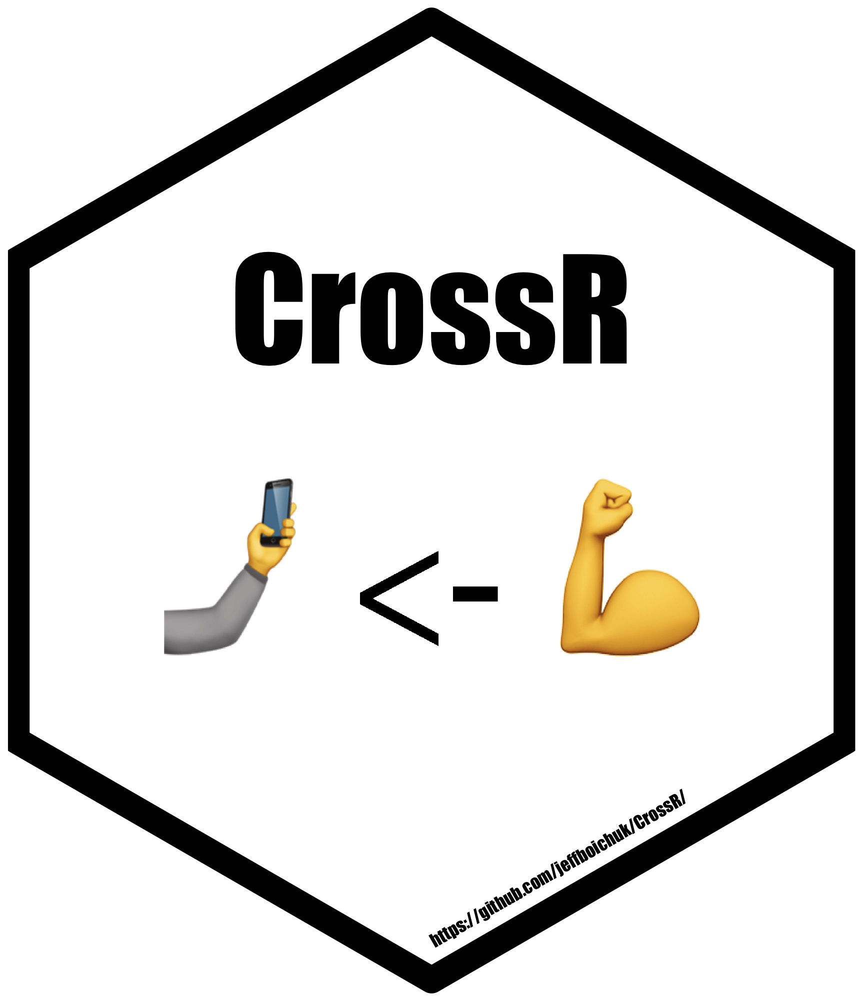

<!-- README.md is generated from README.Rmd. Please edit that file -->

```{r, echo = FALSE}
knitr::opts_chunk$set(
  collapse = TRUE,
  comment = "#>",
  fig.path = "README-"
)
```

# CrossR

[](https://www.tidyverse.org/lifecycle/#stable)

## Overview

**CrossR** is a package meant for instructors to use in leading R users through 
high-intensity interval training (HIIT) exercise sessions. These sessions guide 
R users through simple, hands-on coding activities repetitiously for 20-90 
seconds at a time. The goal is to help R users become more fluent with the R 
programming language and RStudio's shortcuts, while keeping things challenging and fun.

## Installation

You can install `CrossR` from GitHub with:

```{r gh-installation, eval = FALSE}
# install.packages("devtools")
devtools::install_github("jeffboichuk/CrossR")
```
